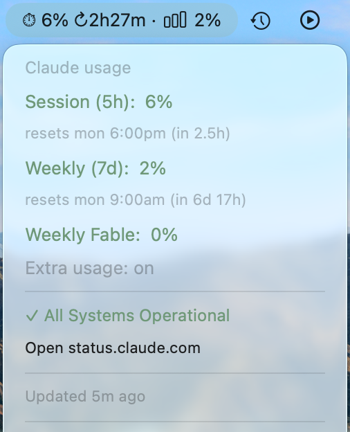

# swiftbar-claude-usage

Menu bar widget showing Claude session (5h) and weekly (7d) usage limits, plus
[status.claude.com](https://status.claude.com) health — via [SwiftBar](https://github.com/swiftbar/SwiftBar).

Reads the OAuth token Claude Code stores in the macOS keychain and calls the
same `/api/oauth/usage` endpoint the Claude Code app uses. Read-only, your
own account — no credentials are transmitted anywhere else.



## Requirements

- macOS
- [SwiftBar](https://github.com/swiftbar/SwiftBar) installed
- Python 3 (macOS system python3 works fine)
- [Claude Code](https://claude.com/claude-code) installed and logged in at least once, so a token exists in the keychain (`Claude Code-credentials`)

## Install

> **Important:** SwiftBar tries to execute *every* file in its plugin folder. Do
> **not** point SwiftBar directly at this repo — it would try to run `README.md`,
> `LICENSE`, and `screenshot.png` as plugins and report them as "Permission
> denied" errors. Instead, keep the repo separate and symlink only the script
> into a dedicated plugin folder.

1. Clone the repo anywhere you like:

   ```bash
   git clone git@github.com:gchen19/swiftbar-claude-usage.git ~/swiftbar-claude-usage
   ```

2. Create a dedicated SwiftBar plugin folder that holds **only** the script, and symlink it in:

   ```bash
   mkdir -p ~/.config/swiftbar
   ln -s ~/swiftbar-claude-usage/claude-usage.1m.py ~/.config/swiftbar/
   ```

3. Make sure the script is executable:

   ```bash
   chmod +x ~/swiftbar-claude-usage/claude-usage.1m.py
   ```

4. In SwiftBar: **Preferences → Plugin Folder** must point at the dedicated folder (`~/.config/swiftbar`), **not** the repo. Then **SwiftBar → Refresh All Plugins** (or click the item's "Force update").

5. The first keychain read may prompt for permission ("SwiftBar wants to access keychain item 'Claude Code-credentials'") — click **Always Allow**.

## Usage

- Menu bar shows session usage %, time to reset, and weekly usage %.
- Click the item for a breakdown (session, weekly, weekly Opus/Sonnet, extra usage) and Claude status page health.
- **Force update** does an immediate re-fetch (bypasses the normal ~10-minute cache interval).
- The `.1m.` in the filename is SwiftBar's refresh interval (every 1 minute); actual network calls are throttled internally to every ~10 minutes to respect the endpoint's rate limit, with cached values shown in between.

## Troubleshooting

- `~/.cache/claude-usage.json` — current cached usage data.
- `~/.cache/claude-usage.log` — append-only log of fetch attempts/outcomes, useful if the widget stops updating.
- "Claude: no token" / "auth expired" — open Claude Code once to refresh the keychain token.
- "Permission denied" errors for `README.md`, `LICENSE`, or `screenshot.png` — SwiftBar is pointed at the repo instead of a dedicated plugin folder. Repoint **Preferences → Plugin Folder** at a folder containing only the script (see [Install](#install)).

## License

[MIT](LICENSE)
